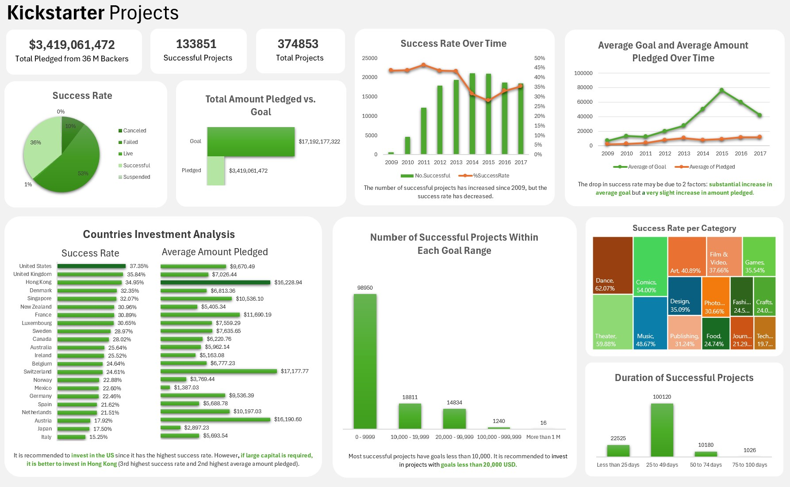

# 💵 Investment Dashboard

## Introduction
I analyzed a set of around 375,000 Kickstarter projects to make investment recommendations. The dataset provided a list of project names, its category, goal, amount pledged, deal stage, number of backers, launched and deadline date, and country. **I used Excel and Power Pivot for this analysis.**

This dataset was taken from [Maven Analytics](https://mavenanalytics.io/challenges/maven-crowdfunding-challenge/bd80ecfd-0989-4e89-ae34-7e997e7daf79).
## Analysis
First, I studied the trends of these projects. I extracted the year from the launched date to find the success rate, average goal, and amount pledged over time. I also calculated the date difference between launched and deadline date to find the duration range of most successful projects.

Next, I analyzed factors for successful projects. I identified success rate and amount pledged by country, as well as success rate by category. I also identified the goal range for successful projects and showed that projects with lower goals are more likely to be successful.

In conclusion, although the number of successful projects have increased since 2009, the success rate of Kickstarter projects have been beginning to decline over time due to the amount pledged that is not increasing in par with the substantial increase in goal. Overall, the key factors to determine successful projects include the goal, category, and country invested.
